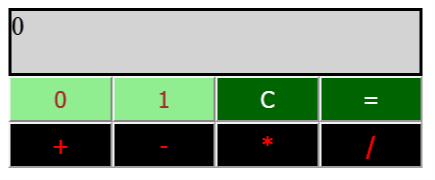

# Binary Calculator
#### Demo: https://shivavamsi.github.io/binary-calculator/
Read more about the binary calculator challenge on [hackerrank](https://www.hackerrank.com/challenges/js10-binary-calculator)

## Binary Calculator Screenshot

  

## Description
This calculator performs operations on binary numbers.

### Operations
* _The buttons labelled '0' and '1' can be used to input a binary number_
* _The addition, subtraction, multiplication and division operations can be performed by clicking on the respective buttons_
* _The '=' button can be used to display the result_
* _The 'C' button can be used to clear the display_

## Notes
#### _Technologies Used:_
* _HTML_
* _CSS_
* _JavaScript_
